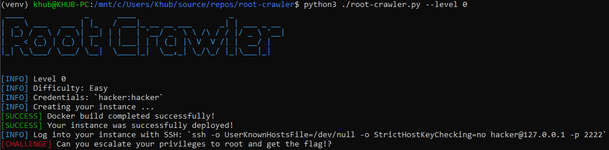
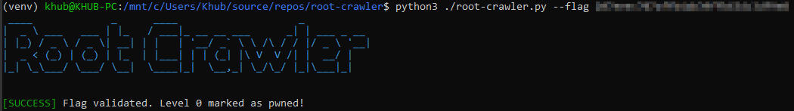
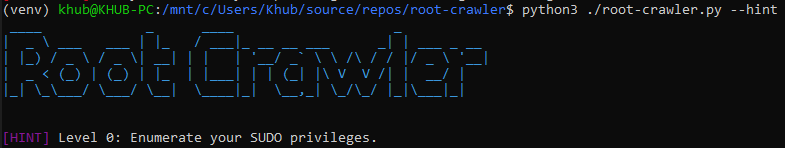

# Root Crawler 🐧


A gamified, hands-on toolkit for learning and practicing Linux Privilege Escalation, powered by Docker!

## 🧩 What is Root Crawler?

Root Crawler turns learning Linux privilege escalation into an exciting game! With each 'level,' you will face a unique challenge, safely contained within a Docker environment. Solve real-world scenarios, uncover hints to guide you, and track your progress as you grow your skills and confidence. Whether you're an aspiring ethical hacker or a seasoned pro looking to refine your techniques, Root Crawler offers a gamified, hands-on learning experience that's as rewarding as it is fun.

- 🔥 **Randomized Encounters**: Roll the dice and spin up a random instance. Can you escalate your privileges to root and capture the flag?
- 🤖 **Hints and Progress Tracking**: Your journey, your rules. Ask for hints when you're stuck, and track your victories along the way.
- 🐳 **Easy Clean-Up**: Done pwning? Sweep away all project containers and images with ease.

## 📋 Prerequisites

- [Python 3.8+](https://www.python.org/downloads/)
- [Docker](https://www.docker.com/get-started/)

## ⚡ Quickstart Guide

### 1. Clone the Repository

```bash
git clone https://github.com/malwaredetective/root-crawler.git
cd root-crawler
```

### 2. Set Up a Python Virtual Environment

```bash
python3 -m venv venv
source venv/bin/activate    # (Windows: venv\Scripts\activate)
```
### 3. Install Python Dependencies
```bash
pip install -r requirements.txt
```

### 4. Verify that Docker is Running
```bash
docker info
```

> If you get an error, make sure Docker Desktop or your Docker service is running.

### 5. Launch a Random Instance and start Hacking!
```bash
python3 ./root-crawler.py --random
```


## 🚀 Usage
Use the following commands to interact with Root Crawler.

```bash
python3 ./root-crawler.py --help
```

| Command | Description |
| --- | --- |
| `--random` | Play a random level. |
| `--difficulty [STRING]` | Specify a difficulty for `--random`. |
| `--flag [STRING]` | Submit a flag. |
| `--hint` | Display a hint for the current level. |
| `--level [INT]` | Play a specific level. |
| `--port [INT]` | Customize the local SSH port for the challenge containers. [Default 2222] |
| `--progress` | Display all levels, difficulties and your current progress. |
| `--reset` | Reset all progress in the local database. |
| `--status` | Show details about the current active level and running container. |
| `--stop` | Stop all active containers related to root-crawler. |
| `--purge` | Stop and remove all containers related to root-crawler. |
| `--update` | Pull the latest root-crawler base images from Docker Hub. |

### Example: Starting a Level
```bash
python3 ./root-crawler.py --level 0
```

Launch a specific level of Root Crawler. All information required to connect to your instance will be printed to the screen.



### Example: Submitting a Flag
```bash
python3 ./root-crawler.py --flag 12345678912345678912345678912345
```

After logging into an instance, escalate your privileges to capture the flag! The flags can *usually* be found at `/root/root.txt`. Once retrieved, submit it to track your progress.



### Example: Requesting a Hint
```bash
python3 ./root-crawler.py --hint
```

If you get stuck, use the `--hint` flag to retrieve a hint for the current level.



## 🧰 Privilege Escalation Tools

Each level includes some common privilege escalation tools, located in `/opt/tools` These are available for your convenience and are completely **optional**. You can solve the levels with or without them.
- [**linpeas.sh**](https://github.com/peass-ng/PEASS-ng/): A robust linux script to search for possible privilege escalation paths.
- [**lse.sh**](https://github.com/diego-treitos/linux-smart-enumeration/): A light-weight linux enumeration script. 
- [**pspy64**](https://github.com/DominicBreuker/pspy/): Allows an unprivileged user to analyze processes running the background.

```
hacker@root-crawler-level-4:~$ ls -l /opt/tools/
total 4024
-rwxr-xr-x 1 hacker hacker  954437 Jun  1 04:38 linpeas.sh
-rwxr-xr-x 1 hacker hacker   55098 Dec 23  2023 lse.sh
-rwxr-xr-x 1 hacker hacker 3104768 Jan 17  2023 pspy64
```

## 🧹 Clean Up
`python3 root-crawler.py --purge` to remove all containers and images associated with Root Crawler. You can restart from scratch any time!

## 🛠️ Troubleshooting
### **Docker is not running!**

> `[ERROR] Failed to initialize Docker client. Details: Error while fetching server API version: ('Connection aborted.', ConnectionRefusedError(111, 'Connection refused')). If you configured this script within a Python virtual environment, make sure it is enabled.`

- Ensure that the Docker service is started.
- If you're using Docker Desktop, verify that it is open and running.

### **A TCP Port is already in use!**
> `[ERROR] Port: 2222 is already in use on this system. Please choose another port using the --port argument.`

- Use the `--port` flag to specify a different, unused port.

### **Permission denied!**
> `ERROR: permission denied while trying to connect to the Docker daemon socket at unix:///var/run/docker.sock: Get "http://%2Fvar%2Frun%2Fdocker.sock/v1.47/info": dial unix /var/run/docker.sock: connect: permission denied`

- Make sure your user is in the `docker` group.
- Log out and log back in for group changes to take effect.

### **No module named docker!**
> `Traceback (most recent call last):
  File "/mnt/c/Users/Khub/source/repos/root-crawler/./root-crawler.py", line 8, in <module>
    import docker
ModuleNotFoundError: No module named 'docker'`
- Double-check that your Python virtual environment is activated.
- Install the required packages with `pip install -r requirements.txt`.

## 📝 License
This project is licensed under the [MIT License](LICENSE). Feel free to use, modify, and distribute this project in accordance with the license terms.

