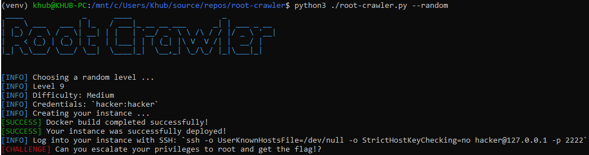

# Root Crawler 🐧

A hands-on, gamified experience for learning Linux Privilege Escalation, powered by Docker!

## 🧩 What is Root Crawler?

Root Crawler turns learning Linux privilege escalation into an exciting game! With each 'level,' you'll face a unique challenge, safely contained within a Docker environment. Solve real-world scenarios, uncover hints to guide you, and track your progress as you grow your skills and confidence. Whether you're an aspiring ethical hacker or a seasoned pro looking to refine your techniques, Root Crawler offers a gamified, hands-on learning experience that's as rewarding as it is fun.

- 🔥 **Randomized Encounters**: Roll the dice and spin up a random instance. Can you escalate your privileges to root and capture the flag?
- 🤖 **Hints and Progress Tracking**: Your journey, your rules. Ask for hints when your stuck, and track your victories along the way.
- 🐳 **Easy Clean-Up**: Done pwning? Sweep away all project containers and images with ease.

## 📋 Prerequisites

- [Python 3.8+](https://www.python.org/downloads/)
- [Docker](https://www.docker.com/get-started/)

## ⚡ Quickstart Guide

### 1. Clone the Repository

```bash
git clone https://github.com/malwaredetective/root-crawler.git
cd root-crawler
```

### 2. Set Up a Python Virtual Environment

```bash
python3 -m venv venv
source venv/bin/activate    # (Windows: venv\Scripts\activate)
```
### 3. Install Python Dependencies
```bash
pip install -r requirements.txt
```

### 4. Verify that Docker is Running
```bash
docker info
```

> If you get an error, make sure Docker Desktop or your Docker service is running.

### 5. Launch a Random Instance and start Hacking!
```bash
python3 ./root-crawler.py --random
```



## 🚀 Usage

`python3 root-crawler.py --help`

| Command | Description |
| --- | --- |
| `--random` | Play a random level. |
| `--difficulty [STRING]` | Specify a difficulty for --random. |
| `--level [INT]` | Play a specific level. |
| `--hint` | Display a hint for the current level. |
| `--flag [STRING]` | Submit a flag. |
| `--progress` | Display all levels, difficulties and your current progress. |
| `--reset` | Reset all progress in the local database |
| `--status` | Print details about the current active level and running container. |
| `--stop` | Stop all active containers related to root-crawler. |
| `--purge` | Stop and remove all containers related to root-crawler. |

# 🛡️ Clean Up
To free disk space and clear all project resources:

`python3 root-crawler.py --purge`
This removes all project containers and images. You can restart from scratch any time!

## 📝 License
This project is licensed under the [MIT License](LICENSE). Feel free to use, modify, and distribute this project in accordance with the license terms.
